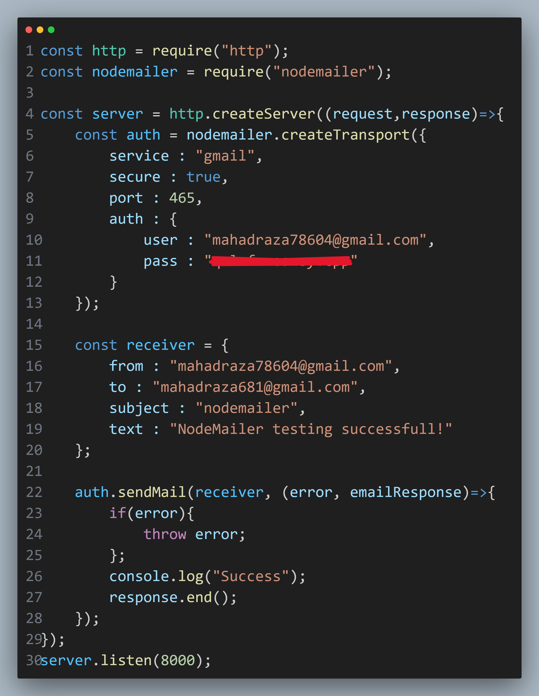

# Nodemailer Email Sending Example

This repository demonstrates how to send emails using **Node.js** and **Nodemailer**. The project includes a basic HTTP server that sends an email when accessed.

---

## Features

- Built with **Node.js**.
- Uses **Nodemailer** for sending emails.
- Configured for **Gmail SMTP** service.
- Easy-to-understand implementation.

---

